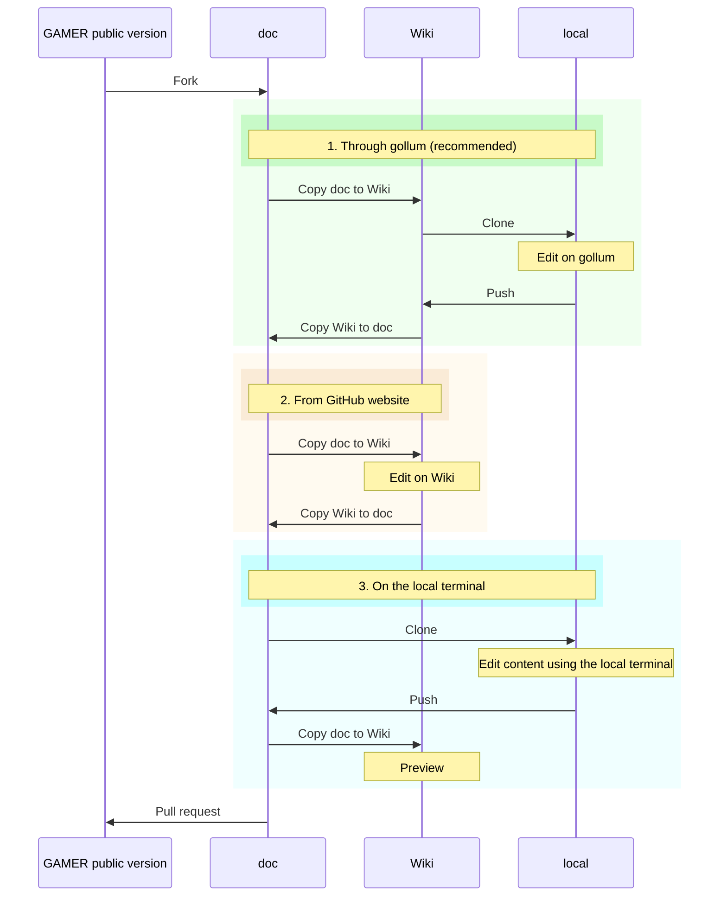

We are glad you have something new to contribute to GAMER and are willing to teach others how to use it!

Before getting started, it’s recommended that you familiarize yourself with the basics of [repository, branch, fork](https://docs.github.com/en/repositories/creating-and-managing-repositories/about-repositories), [action](https://docs.github.com/en/actions), and [workflow](https://docs.github.com/en/actions/using-workflows).

The followings are the outline of this document:
* [Introduction](#Introduction)
* [Initialize Wiki and Enable Action](#Initialize-Wiki-and-Enable-Action)
* [Edit Wiki](#Edit-Wiki)
* [Pull Request](#Pull-Request)
* [Reference](#Reference)

## Introduction
In this document, "Wiki" refers to the Wiki page on the GitHub website, and "doc" stands for the markdown files located under `gamer/doc/wiki`. Note that doc and Wiki are NOT always synchronized. You will need to use the action to copy content either from doc to Wiki or from Wiki to doc.

Here is the squence diagram for Wiki contribitions. You can select any of these three method to edit Wiki. See [Edit Wiki](#Edit-Wiki) for details.

## Initialize Wiki and Enable Action
**_This setup only needs to be done once (the first time) !!!_**

1. **Check GAMER version**
   * Please make sure you have the latest GAMER.

1. **Create the first page**
   * Click the Wiki page and create the first page.

   [[/images/CreateWiki.png]]

1. **Create a token for the action**
   * Go to `Settings` of your account > `Developer settings` > `Personal access tokens` > `Generate new token (classic)`.
      - NOTE: We use the `Tokens (classic)` in this example.
   * Please check the `repo` and the `workflow` options.
      - NOTE: You can set the `Note` of this token freely.
   * You might want to set the `Expiration` to `No expiration`.
   * Click the green `Generate token` at the bottom.

   [[/images/CreateToken.png]]

   * Remember to save the token since it will only be shown once!

1. **Create the repository secret token and email**
   * Go to `Settings` of your forked gamer repository > `Security` > `Secrets and variables` > `Actions` > `Repository secrets`.

   [[/images/CreateSecret.png]]

   * Click `New repository secret`, and then you will see the following. Please replace `<your_personal_access_token>` with the token generated in the previous step under `Secret` and make sure the `Name` of the secret is `TOKEN_FOR_WIKI`. Click `Add secret`.

   [[/images/SetToken.png]]

   * Click `New repository secret`. Please replace `<your_email_address>` with your account's email address under `Secret` and make sure the `Name` of the secret is `MY_EMAIL`. Click `Add secret`.
      - NOTE: Your email address will remain private since it only exists in your repository. This step is only for recording your contribution by the action.

   [[/images/SetMail.png]]

1. **Enable actions (workflows)**
   * Click `Actions` > click the green button.
   [[/images/EnableWorkflows.png]]

1. **Initialize Wiki**
   * Click `Actions` > `Copy doc to wiki` > `Run workflow` > Choose `Branch: main` > Click `Run workflow`. Once the workflow is complete, the Wiki will be updated to match `gamer/doc/wiki` on the `main` branch.

   [[/images/InitializeWiki.png]]

## Edit Wiki
We provide three methods for editing the Wiki pages: through `gollum` (recommended), directly on the GitHub website, or via the local terminal. In the following examples, the new branch you would like to contribute to is referred to as `new_contribution_branch`.

1. **Through `gollum` (recommended)**
   - Install [gollum](https://github.com/gollum/gollum).
   - Click `Actions` > `Copy doc to wiki` > `Run workflow` > Choose `Branch: new_contribution_branch` > Click `Run workflow`. Once the workflow is complete, the Wiki will be updated to match `gamer/doc/wiki` on the `new_contribution_branch` branch.
   - Clone your forked Wiki git. You may find the Wiki URL at the bottom right of the Wiki page.

     [[/images/WikiGitLocation.png]]

   - Edit by `gollum`.
     * NOTE: To use `gollum` for a branch other than `master` (e.g., `new_branch`), use the command `gollum --ref new_branch`.
     * `gollum --lenient-tag-lookup /path/to/wiki`
     * Open `http://localhost:4567` in your browser.
   - Push your changes to the forked Wiki git.
   - **Copy wiki to doc**

     This step is like `git push` to your branch.
     * Click `Actions` > `Copy wiki to doc` > `Run workflow` > Choose `Branch: new_contribution_branch` > Click `Run workflow`. Once the workflow is complete, the content of `gamer/doc/wiki` in the `new_contribution_branch` branch will be updated to match the latest Wiki pages.

     [[/images/CopyWikiToNewBranch.png]]

1. **From GitHub website**

   In this method, we treat the Wiki on GitHub as a local repository and use the workflow to replicate the pull and push behavior for the Wiki.
   - **Copy doc to wiki**

     This step is like `git checkout new_contribution_branch` but for the GitHub Wiki website version.
     * Click `Actions` > `Copy doc to wiki` > `Run workflow` > Choose `Branch: new_contribution_branch` > Click `Run workflow`. Once the workflow is complete, the Wiki will be updated to match `gamer/doc/wiki` on the `new_contribution_branch` branch.

      [[/images/CopyDocFromNewBranch.png]]

   - **Edit directly on the GitHub Wiki website**

      See [About wikis - GitHub Docs](https://docs.github.com/en/communities/documenting-your-project-with-wikis/about-wikis) for more details.
   - **Copy wiki to doc**

     This step is like `git push` to your `new_contribution_branch` branch.
     * Click `Actions` > `Copy wiki to doc` > `Run workflow` > Choose `Branch: new_contribution_branch` > Click `Run workflow`. Once the workflow is complete, the content of `gamer/doc/wiki` in the `new_contribution_branch` branch will be updated to match the latest Wiki pages.

      [[/images/CopyWikiToNewBranch.png]]

1. **On the local terminal**

   This process is similar to editing GAMER source code on the local terminal. The Wiki files are located in `gamer/doc/wiki`. After committing your changes to the `new_contribution_branch` branch and pushing them to GitHub, you can preview these changes on the Wiki pages by
   * Click `Actions` > `Copy doc to wiki` > `Run workflow` > Choose `Branch: new_contribution_branch` > Click `Run workflow`. Once the workflow is complete, the Wiki will be updated to match `gamer/doc/wiki` on the `new_contribution_branch` branch.

## Pull Request
   1. Before filing a new PR, please ensure the following:
      * All hyperlinks are functional.
      * Images are clear.
      * All related pages affected by this PR have been updated.
   2. File a PR to the public GAMER repository.
      * NOTE: Contributions should be made through the files in `gamer/doc/wiki/` rather than the Wiki pages.

## Reference
1. [Bi-directional Wiki Sync Action](https://github.com/marketplace/actions/bi-directional-wiki-sync-action)
1. [Create Pull Requests For Your GitHub Wiki](https://nimblehq.co/blog/create-github-wiki-pull-request)
1. [gollum](https://github.com/gollum/gollum)
